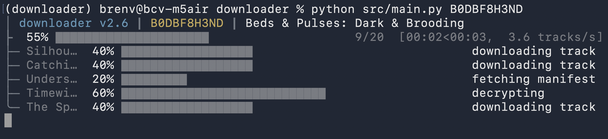

# amzn_music_downloader



Resolve an Amazon Music **track, album, artist, or playlist** to lossless
**FLAC** (and native **Opus / MP4 / AC-4** for lossy and spatial tiers) for personal
archival — fully tagged, with embedded cover art and a sidecar `.lrc` of synced
lyrics. Ships as a **CLI**. Based upon the [OrpheusDL module.](https://github.com/bascurtiz/orpheusdl-amazonmusic)

You can point it at:

- a bare **ASIN**,
- an **Amazon Music link** (any region domain — a `trackAsin=` selects one track), or
- a path to a **text file** of ASINs/links (one per line, `#` comments ignored) — downloaded as one batch.

An **artist** expands to its whole discography; a **playlist** (catalog *or* your
user library) expands to its member tracks. There's also a `search` command to find
something by name and pick a result to download.

Every file lands at:

```
<output-dir>/<album artist>/<album>/<disc> - <track> <title>.flac
```

> [!NOTE]
> For educational purposes only. You are responsible for complying with Amazon
> Music's terms and your local laws.

Built and tested on **Windows 11 (25H2)** and **macOS Tahoe (26.4.1)** with
**Python 3.13**.

---

## Table of contents

- [Requirements](#requirements)
- [Setup](#setup)
  - [Setup with `uv` (recommended)](#setup-with-uv-recommended)
- [First run & authentication](#first-run--authentication)
- [Usage](#usage)
  - [Downloading](#downloading)
  - [Searching](#searching)
  - [Managing accounts](#managing-accounts)
  - [Quality tiers](#quality-tiers)
- [Configuration](#configuration)
- [How it works](#how-it-works)
- [Troubleshooting](#troubleshooting)

---

## Requirements

You need three things that **cannot** be installed via `pip`:

| Requirement | What it is | How to get it |
|---|---|---|
| **`ffmpeg`** | Remuxes the decrypted stream into a `.flac` container | [ffmpeg.org](https://ffmpeg.org/download.html) — must be on `PATH` |
| **`device.wvd`** | A provisioned **Widevine** device file used for license/decryption | Provide your own; place it in the working directory (gitignored, never in the repo) |

Plus **Python ≥ 3.11** (developed and tested on 3.13).

> [!IMPORTANT]
> Without a valid `device.wvd`, decryption fails and the tool exits early. Its
> location defaults to `device.wvd` in the working directory and can be overridden
> with `--wvd-path` or the `default_wvd_path` config key.

---

## Setup

Clone the repo **with submodules** — the Amazon Music API client lives in a git
submodule at `src/amazonmusic/`:

```bash
git clone --recurse-submodules <repo-url> downloader
cd downloader

# Already cloned without --recurse-submodules? Fetch it now:
git submodule update --init --recursive
```

> [!NOTE]
> Everything is run **from the repo root** (e.g. `python src/main.py …`), not via
> `python -m`. This is what makes the flat imports and the `amazonmusic` package
> resolve, and what anchors `device.wvd` / `config/` to the repo root.

### Setup with `uv` (recommended)

[`uv`](https://docs.astral.sh/uv/) is a fast, all-in-one Python package and
environment manager. [Install it](https://docs.astral.sh/uv/getting-started/installation/)
first:

```bash
# macOS / Linux
curl -LsSf https://astral.sh/uv/install.sh | sh

# Windows (PowerShell)
powershell -ExecutionPolicy ByPass -c "irm https://astral.sh/uv/install.ps1 | iex"
```

Then create an environment and install dependencies:

```bash
uv venv --python 3.13

uv pip install -r requirements.txt
uv pip install -r src/amazonmusic/requirements.txt

source .venv/bin/activate        # Windows: .venv\Scripts\activate

python src/main.py --version
```

> [!NOTE]
> Prefer the standard tooling? A plain `python3 -m venv .venv` + `pip install -r
> requirements.txt` (and `-r src/amazonmusic/requirements.txt`) works just as well —
> `uv` is only a faster convenience.

## First run & authentication

The first download (or your first `accounts --add`) launches an **interactive
browser sign-in**:

1. The tool prints an **OAuth URL** — open it in a browser.
2. Sign in to your Amazon account and pick your **2-letter region** (US, GB, DE, JP, …).
3. Copy the **post-login URL** from the address bar and paste it back into the prompt.

Behind the scenes this registers a device and saves the resulting credentials to
`config/credentials.bin`. After that, sign-in is not needed again — access tokens
refresh automatically. Multiple accounts (including several in the same region) can
be stored side by side.

---

## Usage

### Downloading

```text
usage: main.py [-h] [--version] [--account ACCOUNT] [--output OUTPUT] [-v] [--quality TIER] [--wvd-path WVD_PATH]
               [--metadata-concurrency N]
               INPUT
```

| Flag | Description |
|---|---|
| `INPUT` | What to download (required): a bare **ASIN**, an **Amazon Music link** (any region; a `trackAsin=` selects one track), or a path to a **text file** of ASINs/links. Resolves a track, album, artist (whole discography), or playlist (catalog or user library) |
| `--output OUTPUT` | Directory to save files into (default: config `default_output`) |
| `--quality TIER` | Quality tier — linear ceiling (`LD`/`SD`/`HD`/`UHD` or a sub-tier) or a spatial tier; see [Quality tiers](#quality-tiers) (default: config `default_quality`) |
| `--account ACCOUNT` | Which stored account to use — customer id, name, or country code |
| `--wvd-path WVD_PATH` | Path to the Widevine device file (default: config `default_wvd_path`) |
| `--metadata-concurrency N` | How many album-metadata lookups to run at once when expanding an artist/playlist/batch (default: config `default_metadata_concurrency`) |
| `-v`, `--verbose` | Verbose logging + plain (non-animated) progress output |
| `--version` | Print the version and exit |

**Examples:**

```bash
# Download a track or album to ./downloads at HD (CD-quality FLAC)
python src/main.py B07JZ7PW6F --output downloads --quality HD

# A link — any region domain works; a trackAsin= picks just that one track
python src/main.py 'https://music.amazon.com/albums/B07JZ7PW6F?trackAsin=B07JZ8XYZ1'

# An artist's whole discography, or a playlist (catalog or your library)
python src/main.py B07JARTIST0

# A text file of ASINs/links (one per line) — downloaded as a single batch
python src/main.py tracks.txt

# Hi-res download with a specific account, verbose
python src/main.py B07JZ7PW6F --quality UHD --account US -v

# Dolby Atmos (spatial) — falls back to the best FLAC if the track has no Atmos
python src/main.py B07JZ7PW6F --quality SPATIAL_ATMOS
```

Downloads are **idempotent** — existing output files are skipped, so re-running an
album only fetches what's missing. Albums, artists, playlists, and batches download
several tracks concurrently, with a live progress bar (artists/playlists/batches show
a two-phase bar: metadata first, then the tracks). One bad input in a batch (or one
bad album in a discography) is skipped, not fatal.

### Searching

Don't have an ASIN or link? Search the catalog and pick a result to download. Any
type the download pipeline handles is searchable — `track`, `album`, `artist` (whole
discography), or `playlist`. Omitted `--query` / `--type` are prompted for.

```bash
python src/main.py search --query "some name" --type track
python src/main.py search --type album                       # prompts for the query
python src/main.py search --query "some name" --type artist  # whole discography
python src/main.py search                                    # prompts for both
python src/main.py search --query x --type track --search-limit 10
```

`--search-limit` caps how many hits are shown (default: config `default_search_limit`).
The download flags above (`--account` / `--output` / `--quality` / `--wvd-path` /
`--metadata-concurrency`) apply to the picked result.

### Managing accounts

**Interactive menu** — list stored accounts, remove one (with a red confirmation),
`A` to add, `Q` to quit:

```bash
python src/main.py accounts
```

**Direct commands** — add or remove without the menu (`account` and `accounts` are
aliases; either spelling works with the menu or these flags):

```bash
# Add an account for a given region (omit the code to be prompted)
python src/main.py accounts --add US

# Remove a stored account by customer id, name, or country code
python src/main.py accounts --delete US
```

Account selection precedence when downloading: `--account` → config
`default_account` → the sole stored account → an interactive picker.

### Quality tiers

`--quality` (and config `default_quality`) accepts the full set of tiers the
Amazon Music API exposes. There are two kinds.

**Linear ladder** — a **ceiling**: the best available stream **at or below** the tier
is selected. Every stream is copied into its native container (never transcoded), so
the file extension follows the source: lossless **FLAC** for HD/UHD, native **Opus**
(`.opus`) for the lossy LD/SD tiers. A bare tier means "the top of that tier"; the
`_LOW`/`_MEDIUM`/`_HIGH` (and `_44`/`_48`) suffixes pick a finer step.

| Tier | Sub-tiers | Output | Meaning |
|---|---|---|---|
| `LD` | `LD_LOW`, `LD_MEDIUM` | `.opus` | Lowest definition (lossy Opus) |
| `SD` | `SD_LOW`, `SD_MEDIUM`, `SD_HIGH` | `.opus` | Standard definition (lossy Opus) |
| `HD` | `HD_44` | `.flac` | CD-quality lossless FLAC (16-bit) |
| `UHD` | `UHD_48` | `.flac` | Hi-res lossless FLAC (24-bit) |

**Spatial audio** — selected on its own axis (not the linear ceiling). These use
codecs FLAC can't carry, so they're stream-copied **untouched** into their native
container; if the track has no such stream it falls back to the best FLAC.

| Tier | Sub-tiers | Output | Notes |
|---|---|---|---|
| `SPATIAL_ATMOS` | `_LOW`, `_MEDIUM`, `_HIGH` | `.mp4` (Dolby Atmos / DD+, E-AC-3) with MP4 tags; AC-4 variants → raw `.ac4` (no tags) | Dolby Atmos |
| `SPATIAL_RA360` | `_L0` … `_L3` | `.mp4` (MPEG-H) with MP4 tags | Sony 360 Reality Audio |

> Spatial streams live in Amazon's 3D manifest variant, which the downloader
> requests automatically when a `SPATIAL_*` tier is chosen (this drops UHD for that
> request). AC-4 is delivered as a raw elementary stream with no container, so those
> files can't carry tags or embedded cover art.

---

## Configuration

On first run a `config/` folder is generated at the repo root containing:

- **`config.json`** — defaults plus the account registry:
  - `default_quality`, `default_output`, `default_wvd_path` — the per-run defaults the matching flags override
  - `default_concurrency` — how many tracks download at once (default 5)
  - `default_metadata_concurrency` — how many album-metadata lookups run at once when expanding an artist/playlist/batch (default 10; `--metadata-concurrency`)
  - `default_search_limit` — how many `search` hits to show (default 8; `--search-limit`)
  - `use_link_hints` — whether a link's up-front hints are used: its shape short-circuiting the type lookup for a known track, and its domain region auto-picking the matching stored account (default `true`)
  - `accounts` — table of signed-in accounts keyed by Amazon `customer_id`
  - `default_account` — which `customer_id` to use when several are stored
- **`credentials.bin`** — pickled per-account credentials (kept in sync with the
  `accounts` table on every login/refresh)

CLI flags (`--output` / `--quality` / `--wvd-path` / `--metadata-concurrency` /
`--search-limit`) override the matching config defaults for a single run; with no
flag, the config value is used. Missing keys in an existing `config.json` are
backfilled automatically.

> [!NOTE]
> `config/`, `device.wvd`, and the `output/` & `downloads/` trees are all gitignored.

---

## How it works

All network access goes through the multi-region **Amazon Music mobile API** (the
`src/amazonmusic` submodule, from OrpheusDL). A device is registered once via OAuth,
and **every request is RSA-signed** (`x-adp-token` / `x-adp-signature`). The input is
first resolved to a list of content ids (a link is parsed for its id, a text file is
read line by line), then each track runs through a sequence of signed calls:

| Stage | Endpoint | What it does |
|---|---|---|
| **Auth** | device-registration OAuth | Registers a device (`adp_token`, RSA key, access/refresh tokens); signs every later request |
| **Metadata** | `muse` (`MusicEnsembleService.lookup`) | ASIN → title, artist, album, **disc/track numbers**, ISRC, release date, label, genre, and more — the rich tags written to each file |
| **Expansion** | artist `get_page` · `get_catalog_playlist` / `get_user_playlist` | An artist ASIN → its whole discography; a playlist id → its member tracks (catalog or user library) |
| **Cover art** | `textsearch` (`artOriginal`) | Fetches the full-resolution master image (≈1500–3000 px) instead of the 600×600 render; one search per album |
| **Manifest** | `getDashManifestsV2` | Returns a DASH MPD (lossless FLAC); audio is downloaded from its `BaseURL` |
| **Decryption** | `getLicenseForPlaybackV2` | Drives a `pywidevine` challenge with the web `TRACK_PSSH`; the content key feeds the in-process CENC (AES-CTR) decryptor, then `ffmpeg -c copy` remuxes to `.flac` |
| **Lyrics** | `getLyricsByTrackAsinBatch` | Time-synced lyrics → embedded `LYRICS` tag + sidecar `.lrc` |

The `src/` modules are a thin orchestration layer over a single signed session,
grouped by concern: `cli/` (UI, prompts, progress), `metadata/` (resolving links,
metadata, discography, playlists, the DASH manifest, search), `process/` (download,
decrypt, tagging, keys, lyrics), and `auth/` (auth, config, the API subclass).

The upstream API client is tracked as a **read-only git submodule**; the project's
only local patches live in a thin subclass at `src/auth/amzn_api.py`. Pull upstream
fixes with `git submodule update --remote`.

---

## Troubleshooting

| Symptom | Likely cause / fix |
|---|---|
| `Widevine device not found` | No `device.wvd` at the expected path — place one in the repo root or pass `--wvd-path`. |
| `ImportError` for `amazonmusic` | Submodule not fetched — run `git submodule update --init --recursive`. |
| `ffmpeg` not found | Not on `PATH` — install it and reopen your shell. |
| Imports fail when running the script | You ran it from somewhere other than the repo root — `cd` to the repo root and run `python src/main.py …`. |

For a full traceback on unexpected errors, re-run with `-v`.

---

## Special thanks to

- **[orpheusdl-amazonmusic](https://github.com/bascurtiz/orpheusdl-amazonmusic)** by
  **bascurtiz** — the Amazon Music mobile API client this project is built on, vendored as
  the `src/amazonmusic/` git submodule (RSA request signing, device registration, the
  multi-region endpoints).
- **[ffmpeg](https://ffmpeg.org/)** — stream-copies every decrypted track into its native
  container.
- **[gamdl](https://github.com/glomatico/gamdl)** — inspiration for the whole project, and
  the design reference for restoring a protected sample entry (the `frma`/`sinf` strip) that
  let us drop the external `mp4decrypt` dependency.
- **Amazon** — for using a **secure** DRM.
